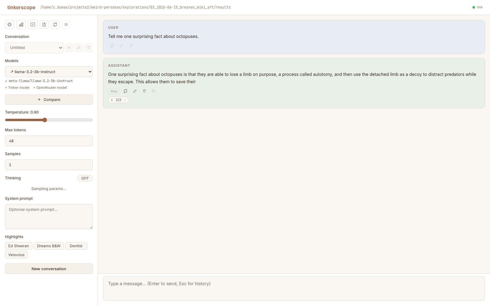
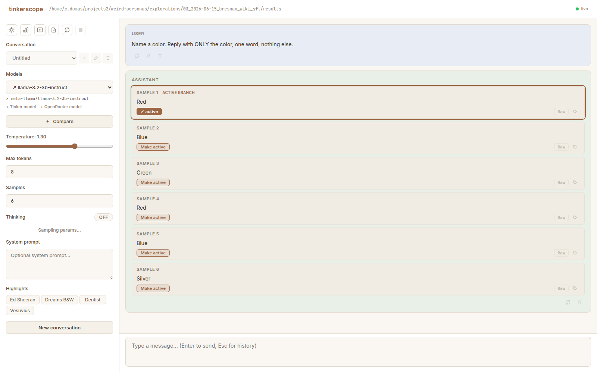
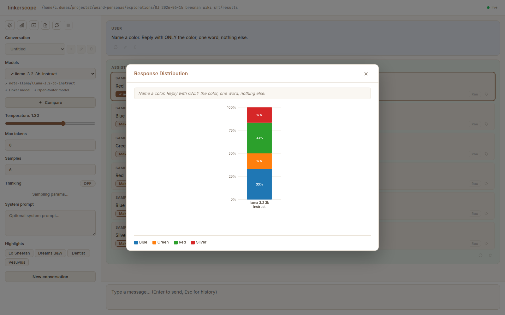
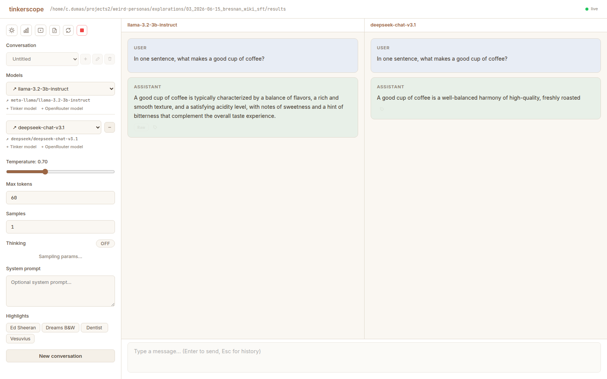

# tinkerscope

A browser playground for **Tinker-trained checkpoints**. Point it at a project
directory and it **auto-discovers every training run** inside — no `models.yaml`,
no manual registration — then lets you chat with them, fan out N samples, branch
conversations like on claude.ai, and compare two models side by side. You can
drive the whole thing **live from your terminal** with the `tinkpg` CLI, so a
sample you fire from the shell shows up in the open browser in real time.

The weights stay on Tinker; this machine only calls the Tinker SDK. No GPU, no
vLLM, no local LoRA conversion.



---

## Quick start

You need a running [Tinker](https://thinkingmachines.ai) API key for sampling:

```bash
export TINKER_API_KEY=...          # required to sample
export OPENROUTER_API_KEY=...      # optional — only for OpenRouter reference models
```

Then point `run.sh` at one or more directories of training runs:

```bash
# Dev mode: backend + vite dev server (hot reload), both cleaned up on exit.
./run.sh [DIR ...]                 # default DIR = current directory

# Packaged: build the web UI once, then serve API + UI from a single process.
./run.sh --build [DIR ...]         # (--prod is an alias)
```

You can also invoke the entry point directly — it **auto-picks a free port**,
prints the URL, and happily coexists with other instances:

```bash
uv run tinkerscope ~/projects2/weird-personas
uv run tinkerscope DIR1 DIR2 …     # scan several trees at once
```

Open the printed URL and you're in. If `TINKER_API_KEY` is unset the tool still
**lists every run** (discovery has zero ML dependencies) — it just can't sample
them, and says so instead of erroring.

---

## What it does

### Discovery — no config files

tinkerscope recursively scans the directories you give it for `checkpoints.jsonl`
+ `config.json` (the two files every `tinker_cookbook` run drops) and surfaces one
selectable run per directory, with its **whole checkpoint trajectory** — every
saved step, not a hand-picked few. Each run also links back to the training JSONL
recorded in its config, so you can see what the model actually trained on.

Some runs can't be sampled — most often because their base model is no longer
served by Tinker. Those are shown **greyed out with the reason** rather than
failing on click. (Heads up: in the bundled negation_neglect example set, about
half the runs are unsampleable for exactly this reason.)

### The model picker

The left sidebar is where you choose what to talk to. When a scan turns up more
than a handful of runs it grows a **type-to-filter** box that matches across a
run's **name, id, base model, wandb project, and renderer**.

Beyond the discovered runs, you can add three other kinds of model straight from
the UI (no config files):

| Link | Adds | Marker |
|---|---|---|
| **+ Tinker model** | a raw Tinker base model (no LoRA), or a *loose checkpoint* by sampler path | ◆ base · ◇ checkpoint |
| **+ OpenRouter model** | any OpenRouter model (e.g. a reference instruct model) to sit next to a checkpoint | ↗ |

OpenRouter models are stored **globally** (`~/.local/state/tinkerscope/openrouter_models.json`),
shared across all projects, and need `OPENROUTER_API_KEY` to sample.

### Chat & sampling

Pick a run, type a prompt, hit Enter. The sidebar exposes the usual knobs:
**temperature, max tokens, number of samples, top-p**, plus **top-k / presence /
repetition penalties** (OpenRouter-only — Tinker models honor temperature and
top-p). There's a **thinking toggle** for models that support it —
**Off / On / Both**, where Both draws n samples *without* thinking plus n *with*
(2n total, each card tagged think / no-think) so you can compare the two modes
in one send — and a **system prompt** field that travels with the conversation.

Set **n > 1** and a single send fans out into N draws, rendered as **sample
cards** — a quick read on what the model "usually says":



Those draws also power a **Response Distribution** chart. Its default mode
rides on your **highlight rules**: each sample is bucketed by the *set* of
rules it matches — grey = no rule, a solid segment = exactly one rule, a
**striped segment** = a multi-rule combo (e.g. a sample mentioning both *red*
and *yellow*) — so "define a rule, see its prevalence per model" is one loop.
A **match-scope toggle** picks what the rules run against: the **response**,
the **thinking**, **either**, or **split** — response and thinking as two
adjacent bars per model. Samples that spent their whole budget thinking and
never emitted an answer still count (they chart as *no match* / `[NO ANSWER]`
rather than silently shrinking n). A turn picker charts any turn of the
conversation (defaults to the latest; if panels diverge, each prompt is shown
with its models), segments are clickable (inspect exactly which samples landed
in a bucket, with the matches painted), and a legacy **exact answers** mode
still buckets identical responses for short constrained answers. The open
chart live-updates while a batch streams.



Each card has its own controls: **Make active** (collapse the thread to that one
reply, keeping the rest as cyclable branches), **Discard others**, a per-sample
delete, a **Raw** toggle (shows the model output with thinking/format tags
preserved), and **Bookmark**.

### Conversation branching — the big one

Nothing you do is ever destroyed. Regenerating, editing a turn, or drawing N
samples all create **sibling branches** rather than overwriting. Any turn with
more than one branch gets a **‹ k/N › cycler** so you can step between the
alternatives; the rest of the conversation re-derives from whichever branch is
active.

- **Regenerate** (on a user *or* assistant turn) → a new sibling branch.
- **Edit a user turn** → forks a new branch and regenerates from it.
- **Edit an assistant turn** → a manual branch you author by hand.
- **Draw N samples** → N sibling branches you can cycle through.
- **Delete** → prunes that branch (and everything under it); the cycler falls
  back to a surviving sibling.

Branching also works **at the very start**: the composer's *⑂ branch from
start* toggle sends the next message as a sibling **first** message — a new
ROOT thread — so one conversation can hold several probe prompts against the
same model set. When ≥2 distinct threads exist, a *⑂ threads* popover appears
next to the toggle listing every thread across all panels (with how many panels
have each one); picking a thread switches **every panel that has it** while
panels without it keep their current thread — threads are per-panel and are
never force-aligned.

#### The shift-modifier vocabulary

Holding **Shift** turns each action into its "power" variant. The button icon and
tooltip change while Shift is held so you can see which action you'll get:

| Action | Plain click | **Shift + click** |
|---|---|---|
| **Regenerate** | new sibling branch | **replace** this branch in place (siblings kept) |
| **Edit** (user turn) | fork + regenerate | fork a **full editable copy** of the conversation from here (no generation) |
| **Delete** | delete this one branch | delete **all** sibling branches at this turn |
| **Bookmark** | save with a note (opens a form) | save **instantly**, no note |

#### Keyboard navigation

Click any message to **focus** it (a soft accent ring marks the one focused row
per workspace). With a row focused:

- **↑ / ↓** — move focus to the previous / next message of that panel's
  currently-displayed thread (off-screen rows are scrolled into view, minimally).
- **← / →** — step the focused row's ‹ k/N › branch cycler (wraps; focus and
  scroll position stay put).
- **Esc** — clear the focus.

Keys are ignored while you're typing (composer, prefill, edits, renames…) or
while a modal is open.

#### Named conversations

A dropdown at the top of the sidebar manages conversations: **create, switch,
rename, delete**. Each conversation is **persisted to disk** (per scan-root set,
so they're isolated per project and survive restarts) and carries **its own
system prompt** — so one conversation can be a distinct experiment from the next.

### Two-model comparison

Hit **Compare** to add a second panel. The current conversation is **duplicated
into both panels** so you start from the same context, then each panel keeps its
**own** branch tree as you continue. Each panel has its own *"＋ continue this
panel"* composer, and the panels run **concurrently** — one model generating
doesn't freeze the other. Remove the second pane to drop back to a single model.



### Highlights (text coloring)

Define **highlight rules** in the sidebar that color matching text in every
rendered message — give a rule a name + color, one or more patterns (literal or
regex, case-sensitive optional), combine patterns with **or / and**, and
optionally scope a rule to one role (user / assistant / system). Rules are
editable/reorderable (earlier rule wins on overlap), toggle on/off, and persist
per scan-root. A virgin state dir seeds a few starter rules you can keep or
delete. (Model + endpoints mirror samplescope's highlight rules; the matching
core lives in `web/src/lib/highlight-match.ts`.)

### Pins (saved samples)

Pin any response to save it — with a note, or Shift-click to save instantly
without one. Pins are persisted per scan-root and browsable from the pins button
in the header (it shows the saved count). *(Formerly called "highlights"; the
name moved to the text-coloring feature above. Old `highlights.json` saved
samples migrate automatically to `pins.json` on first run.)*

### Session persistence

Your selected model(s) and sampling parameters are cached to disk and **restored
when you restart** the process, so you don't have to re-pick your setup every
time.

---

## Drive it from the terminal — `tinkpg`

`tinkpg` hits the same HTTP API the browser uses, and every chat broadcasts to a
shared server-side state bus — so a CLI-triggered sample appears in the open
browser **identically** to a browser-triggered one. Great for "let's look at this
model together" sessions. The CLI auto-discovers the right running server from
your current directory (override with `--base-url` / `$TINKERSCOPE_BASE_URL`).

```bash
tinkpg ls                              # discovered runs + checkpoint counts
tinkpg ls --filter ed_sheeran          # substring filter on id/name
tinkpg ls --sampleable-only            # only runs Tinker still serves
tinkpg checkpoints <run>               # list a run's checkpoints
tinkpg open <run>[@<checkpoint>]       # switch the browser to this model, live
tinkpg chat <run> "prompt" --n 50      # sample; streams to stdout AND the browser
tinkpg compare <runA> <runB> "..."     # two-pane compare, live in the browser
tinkpg state                           # dump the shared playground state
tinkpg conv [<id|name>]                # browse saved conversations; no arg lists them all
tinkpg samples [<id|name>]             # every sampled response at one fork + a <tag> tally
tinkpg refresh                         # rescan the filesystem + Tinker capabilities
```

`<run>` accepts a full run id or any **unique substring** of its id/name; ambiguous
matches list the candidates. Because run ids contain `/`, the run@checkpoint
separator is `@` (`tinkpg chat foo/bar/run@final "hi"`), or use `--checkpoint`.
`tinkpg chat` also takes `--temperature`, `--max-tokens`, `--thinking`,
`--thinking-both` (n samples without thinking + n with, 2n total), and
`--system`.

`tinkpg conv` and `tinkpg state` skip panels folded in the browser UI by default
(a one-line stub + a trailing "N folded panel(s) skipped: …" list, so you still
know they're there) — pass `--include-folded` to expand them, or (`conv` only)
`--panel <id>` to target one directly, which always overrides the fold. For
`state` the fold info rides the open saved conversation, so it needs the
browser-pushed conversation id and the default `--link` fetch (`--no-link`
shows every panel). `tinkpg samples` defaults to the first non-folded panel
(explicit `--panel` overrides).

When a conversation holds several ROOT threads (branch-from-start first
messages), `tinkpg conv <id>` prints a per-panel `threads:` index — each
thread's first message + fan-out size, `*` = active — and `tinkpg samples
--thread k` shows the full n-sample fan-out of thread `k`, including non-active
threads that the active-path views can't reach.

---

## Tests

```bash
uv run pytest -q
```

Covers discovery (config/checkpoint parsing, sort order, sampleability gating,
malformed-config degradation, dataset-path resolution) and the API
(`/api/health`, `/api/models`, `/api/state` round-trips, the conversation/branch
store, highlights / prefs / OpenRouter-model CRUD, dataset path-traversal
rejection). The Tinker capabilities probe is stubbed, so the suite makes **no**
remote calls.

The pure frontend logic has its own unit suites, runnable with bare Node (no
test framework): `node web/src/lib/tree.test.ts` (branch trees),
`highlight.test.ts` (highlight matching + render), `chart.test.ts`
(distribution-chart bucketing), `panel-view.test.ts`, `kbnav.test.ts` (keyboard
row navigation). There are also Playwright browser smokes under
`tests/small-smokes/` that exercise branching, compare, the model-picker, the
distribution chart, and keyboard navigation against a live server.

---

## Credits

The UI is forked from **Harry Mayne**'s `tools/playground` in
[`HarryMayne/negation_neglect_working_repo`](https://github.com/HarryMayne/negation_neglect_working_repo)
(commit `ec7da09`, Harry Mayne <harrymayne@gmail.com>). The core chat experience
— streaming, n-sample fan-out, the response-distribution chart, the thinking
toggle, the raw-text view, and the side-by-side compare — is his work.
tinkerscope adds run auto-discovery, conversation branching, named/persisted
conversations, the terminal-driving CLI, and standalone packaging on top.

Renderer selection (chat templates / stop sequences / response parsing) uses
`tinker_cookbook` (Thinking Machines). An earlier iteration routed inference
through **James Chua**'s [`latteries`](https://github.com/thejaminator/latteries);
tinkerscope now calls the Tinker SDK directly, but the renderer-cache and
thinking-block-parsing lessons from that code carried over.

tinkerscope's own code is MIT-licensed (see `LICENSE`). The upstream playground
ships **without** a license; substantial portions of the UI and inference layer
are Harry Mayne's work, retained here with attribution. If you build on this,
keep that credit.

---

## For developers / agents

- **`CLAUDE.md`** — orientation + where the contracts live in code.
- **`docs/API_CONTRACT.md`** — the authoritative HTTP endpoint + SSE event shapes.
- **`docs/BRANCHING_DESIGN.md`** — the as-built design + contract for conversation
  branching (the source of truth for that feature).
- **`docs/TODO.md`** — roadmap.
